# 💰 Budget Tracker - Application MERN Full-Stack


> Application web de gestion de budget personnel avec authentification sécurisée JWT, graphiques interactifs et isolation multi-utilisateurs.

---

## 🌟 Démonstration en ligne

**🔗 [Voir l'application en ligne](https://mon-budget-tracker-gold.vercel.app)** 

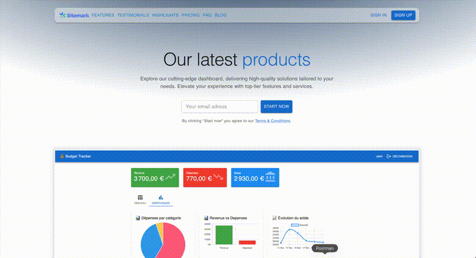
**Compte de test :**
- Email : `clem@mail.com`
- Mot de passe : `1234azerty`

---

## 📋 Table des matières

- [Fonctionnalités](#-fonctionnalités)
- [Technologies](#-technologies)
- [Screenshots](#-screenshots)
- [Architecture](#-architecture)
- [Installation](#-installation)
- [Utilisation](#-utilisation)
- [API Endpoints](#-api-endpoints)
- [Sécurité](#-sécurité)
- [Problèmes rencontrés](#-problèmes-rencontrés-et-solutions)
- [Roadmap](#-roadmap)
- [Auteur](#-auteur)

---

## ✨ Fonctionnalités

### 🔐 Authentification & Sécurité
- ✅ Inscription et connexion sécurisées
- ✅ Authentification JWT avec tokens expirables (30 jours)
- ✅ Hashage des mots de passe avec bcrypt (10 rounds)
- ✅ Isolation complète des données par utilisateur
- ✅ Protection des routes backend et frontend
- ✅ Gestion de mot de passe oublié avec tokens temporaires
- ✅ Déconnexion sécurisée

### 💼 Gestion des Transactions
- ✅ Création, lecture, modification et suppression (CRUD complet)
- ✅ Catégorisation des transactions (Revenus / Dépenses)
- ✅ Catégories prédéfinies personnalisables
- ✅ Descriptions optionnelles
- ✅ Dates personnalisables
- ✅ Validation des données côté client et serveur

### 📊 Statistiques & Visualisation
- ✅ Calcul automatique des totaux (Revenus, Dépenses, Solde)
- ✅ **3 graphiques interactifs avec Chart.js :**
  - 🥧 Camembert : Répartition des dépenses par catégorie
  - 📊 Barres : Comparaison Revenus vs Dépenses
  - 📈 Ligne : Évolution du solde dans le temps
- ✅ Statistiques en temps réel
- ✅ Interface à onglets (Tableau / Graphiques)

### 🎨 Interface Utilisateur
- ✅ Design moderne avec Material-UI
- ✅ Interface responsive (mobile, tablette, desktop)
- ✅ Formulaires avec validation en temps réel
- ✅ Messages d'erreur explicites
- ✅ Loading states et feedback visuel
- ✅ Navigation intuitive

---

## 🛠 Technologies

### Backend
| Technologie | Description | Version |
|------------|-------------|---------|
| **Node.js** | Environnement d'exécution JavaScript | 18+ |
| **Express.js** | Framework web minimaliste | 4.x |
| **MongoDB** | Base de données NoSQL | 6.x |
| **Mongoose** | ODM pour MongoDB | 8.x |
| **JWT** | JSON Web Tokens pour l'authentification | 9.x |
| **Bcrypt.js** | Hashage sécurisé des mots de passe | 2.x |
| **CORS** | Gestion des requêtes cross-origin | 2.x |
| **dotenv** | Variables d'environnement | 16.x |

### Frontend
| Technologie | Description | Version |
|------------|-------------|---------|
| **React** | Bibliothèque UI | 18.x |
| **Vite** | Build tool moderne | 5.x |
| **Material-UI (MUI)** | Framework de composants React | 5.x |
| **Chart.js** | Bibliothèque de graphiques | 4.x |
| **React Chart.js 2** | Wrapper React pour Chart.js | 5.x |
| **React Router DOM** | Gestion de la navigation | 6.x |
| **Context API** | Gestion d'état globale | React 18 |

---

## 📸 Screenshots

### Dashboard - Graphiques interactifs

*Vue d'ensemble avec cartes de statistiques dynamiques*
*3 graphiques Chart.js : Camembert, Barres et Ligne*

### Page de connexion
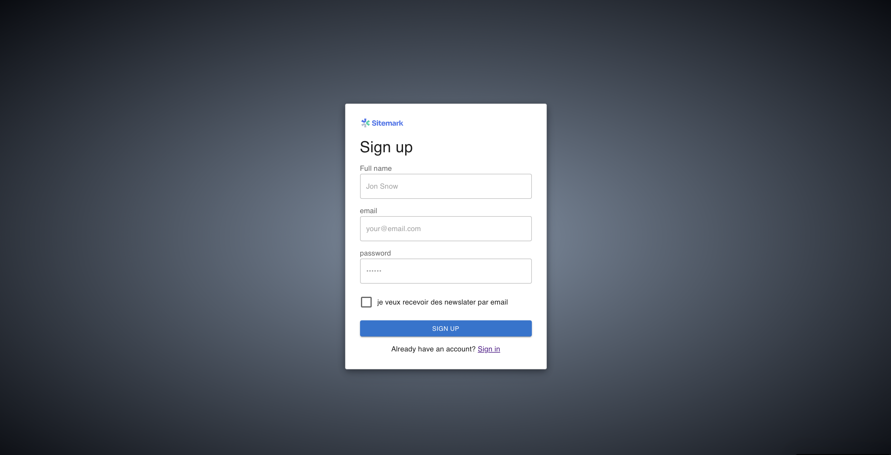
*Interface de connexion sécurisée avec validation en temps réel*

### Page d'inscription
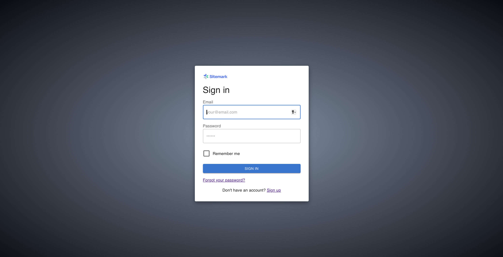
*Interface d'inscription sécurisée*

### Mot de passe oublié
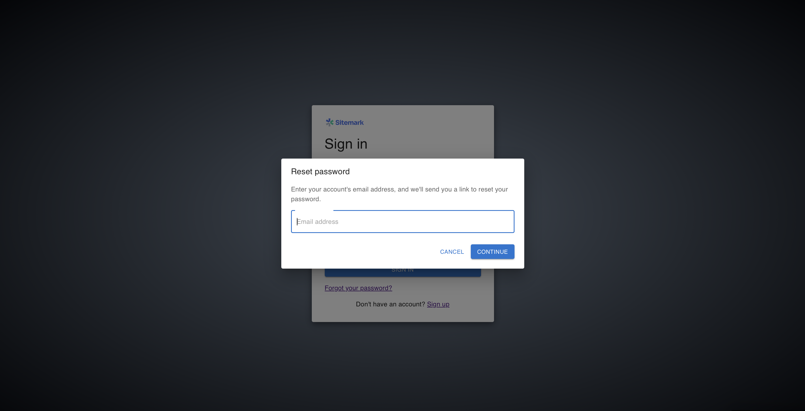
*formulaire d'envoie par email*

### Tableau des transactions
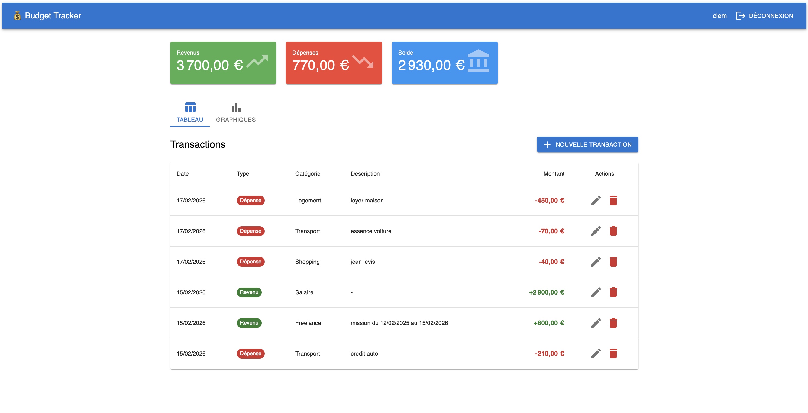
*Liste complète des transactions avec actions CRUD*


### Formulaire d'ajout
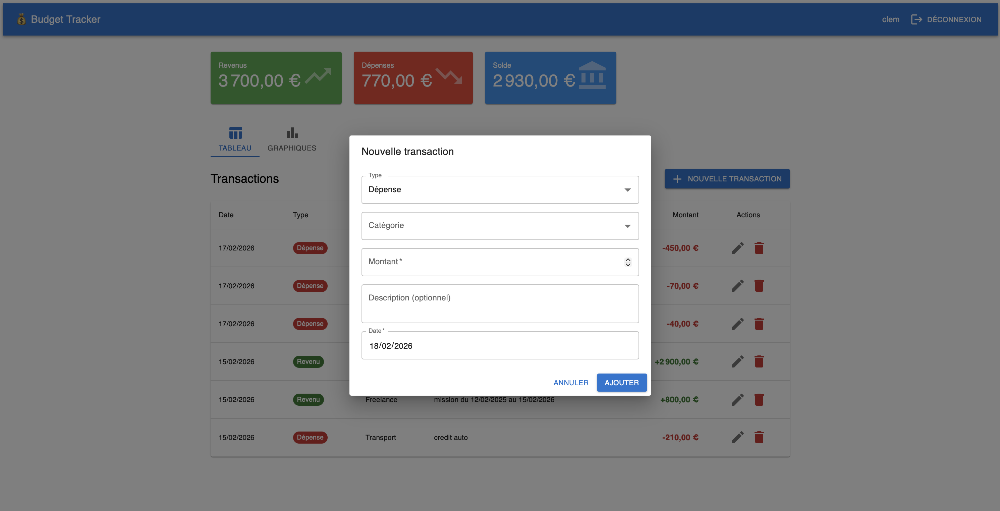
*Formulaire modal pour créer/modifier une transaction*

### Vue mobile
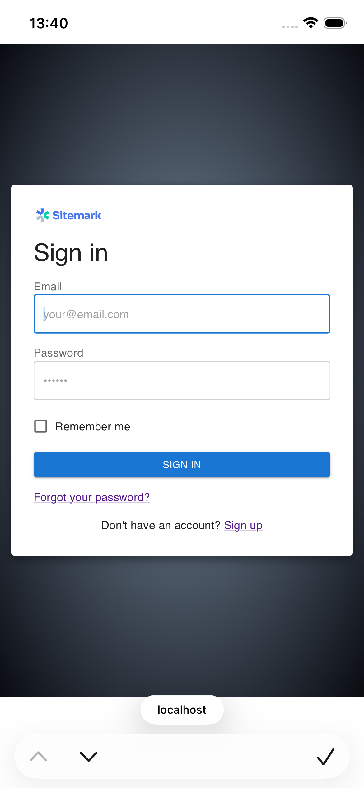
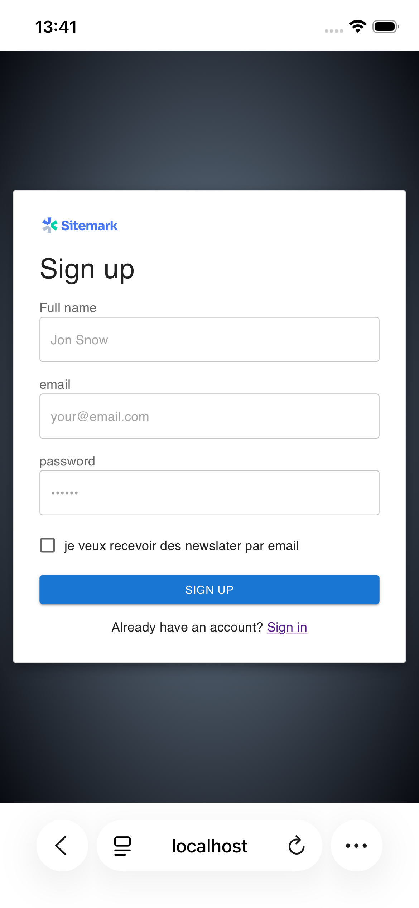
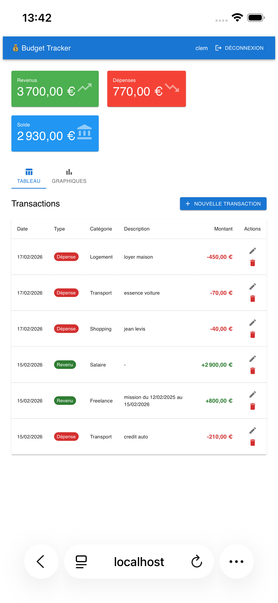
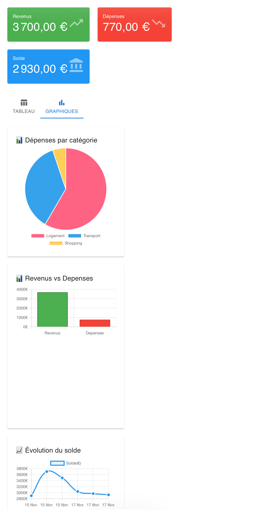
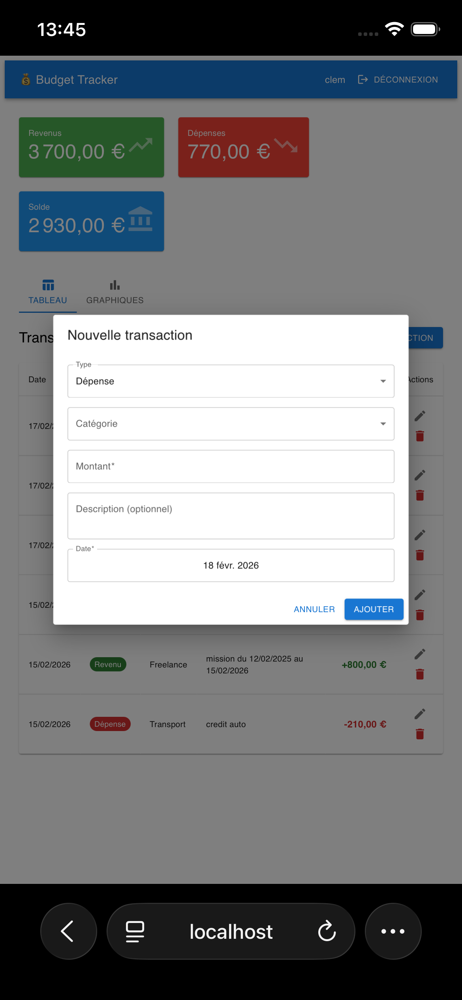
*Design responsive adapté aux mobiles*

---

## 🏗 Architecture

### Structure Backend (MVC)
```
Backend/
├── controllers/
│   ├── authController.js       # Logique authentification
│   └── transactionController.js # Logique transactions
├── middleware/
│   └── authMiddleware.js       # Protection des routes JWT
├── models/
│   ├── User.js                 # Schéma utilisateur
│   └── Transaction.js          # Schéma transaction
├── routes/
│   ├── authRoutes.js           # Routes /api/auth
│   └── transactionRoutes.js    # Routes /api/transactions
├── utils/
│   └── sendEmail.js            # Utilitaire envoi emails
├── server.js                   # Point d'entrée
├── .env                        # Variables d'environnement
└── package.json
```

### Structure Frontend
```
Frontend/
├── src/
│   ├── Components/
│   │   ├── Login.jsx           # Page connexion
│   │   ├── SignUp.jsx          # Page inscription
│   │   ├── Dashboard.jsx       # Page principale
│   │   ├── Charts.jsx          # Composant graphiques
│   │   ├── ProtectedRoute.jsx  # HOC routes protégées
│   │   └── ForgotPassword.jsx  # Modal mot de passe oublié
│   ├── context/
│   │   └── AuthContext.jsx     # Context authentification
│   ├── services/
│   │   └── api.js              # Service API centralisé
│   ├── App.jsx                 # Composant racine
│   ├── main.jsx                # Point d'entrée
│   └── App.css                 # Styles globaux
├── .env                        # Variables d'environnement
└── package.json
```

### Flux de données
```
┌─────────────────────────────────────────────────────────┐
│                      UTILISATEUR                        │
└────────────────────┬────────────────────────────────────┘
                     │
                     ▼
         ┌───────────────────────┐
         │   React Frontend      │
         │  (Material-UI + MUI)  │
         └───────────┬───────────┘
                     │
                     │ fetch() avec JWT
                     ▼
         ┌───────────────────────┐
         │  Express Backend      │
         │  (REST API)           │
         └───────────┬───────────┘
                     │
                     │ Middleware JWT
                     ▼
         ┌───────────────────────┐
         │  MongoDB Database     │
         │  (Mongoose ODM)       │
         └───────────────────────┘
```

---

## 🚀 Installation

### Prérequis
- Node.js 18+ ([Télécharger](https://nodejs.org/))
- MongoDB ([Local](https://www.mongodb.com/try/download/community) ou [Atlas](https://www.mongodb.com/atlas))
- npm ou yarn

---

### 1. Cloner le projet
```bash
git clone https://github.com/votre-username/budget-tracker.git
cd budget-tracker
```

---

### 2. Configuration Backend

```bash
cd Backend
npm install
```

**Créez le fichier `.env` :**
```env
PORT=5000
MONGODB_URI=mongodb://localhost:27017/budget_tracker
JWT_SECRET=votre_secret_jwt_super_securise
JWT_EXPIRES_IN=30d
CLIENT_URL=http://localhost:5173
NODE_ENV=development
```

**⚠️ Important :** Générez un JWT_SECRET sécurisé :
```bash
node -e "console.log(require('crypto').randomBytes(32).toString('hex'))"
```

**Démarrez le backend :**
```bash
npm run dev
```

Vous devriez voir :
```
✅ Connecté à MongoDB
🚀 Serveur lancé sur le port 5000
```

---

### 3. Configuration Frontend

```bash
cd Frontend
npm install
```

**Créez le fichier `.env` :**
```env
VITE_API_URL=http://localhost:5000/api
```

**Démarrez le frontend :**
```bash
npm run dev
```

Vous devriez voir :
```
VITE ready in ... ms
➜  Local:   http://localhost:5173/
```

---

### 4. Tester l'application

1. Ouvrez `http://localhost:5173`
2. Créez un compte (Sign Up)
3. Connectez-vous
4. Ajoutez vos premières transactions
5. Explorez les graphiques !

---
## 🌐 Déploiement

### Backend sur Railway

1. Créez un compte sur [Railway.app](https://railway.app)
2. **New Project** → **Deploy from GitHub repo**
3. Sélectionnez votre repo
4. **Settings** → **Root Directory** : `Backend`
5. **Variables** → Ajoutez :
   ```env
   PORT=2000
   MONGO_URI=votre_mongodb_atlas_uri
   JWT_SECRET=votre_secret_production
   JWT_EXPIRES_IN=30d
   NODE_ENV=production
   CLIENT_URL=https://votre-domaine.vercel.app
   ```
6. **Settings** → **Networking** → **Generate Domain**
7. Copiez l'URL : `https://votre-app.up.railway.app`

---

### Frontend sur Vercel

1. Créez un compte sur [Vercel.com](https://vercel.com)
2. **New Project** → Import votre repo GitHub
3. **Configure** :
   - **Root Directory** : `Frontend`
   - **Framework Preset** : Vite
4. **Environment Variables** :
   ```env
   VITE_API_URL=https://votre-app.up.railway.app/api
   ```
5. **Deploy**
6. Copiez l'URL de production

---

### MongoDB Atlas (gratuit)

1. Créez un compte sur [MongoDB Atlas](https://www.mongodb.com/atlas)
2. Créez un cluster M0 (gratuit)
3. **Database Access** → Créez un utilisateur
4. **Network Access** → Ajoutez `0.0.0.0/0` (accès depuis partout)
5. **Connect** → Copiez l'URI de connexion
6. Ajoutez l'URI dans Railway (`MONGO_URI`)

---

## 📖 Utilisation

### Créer un compte
1. Cliquez sur "Sign up"
2. Remplissez le formulaire (nom, email, mot de passe)
3. Vous êtes automatiquement connecté

### Ajouter une transaction
1. Cliquez sur "Nouvelle transaction"
2. Choisissez le type (Revenu / Dépense)
3. Sélectionnez une catégorie
4. Entrez le montant et une description (optionnel)
5. Choisissez la date
6. Cliquez sur "Ajouter"

### Voir les statistiques
- Les cartes en haut affichent vos totaux en temps réel
- Cliquez sur l'onglet "Graphiques" pour voir les visualisations

### Modifier/Supprimer une transaction
- Cliquez sur l'icône ✏️ pour modifier
- Cliquez sur l'icône 🗑️ pour supprimer

---

## 🔌 API Endpoints

### Authentification

| Méthode | Endpoint | Description | Auth |
|---------|----------|-------------|------|
| POST | `/api/auth/register` | Créer un compte | ❌ |
| POST | `/api/auth/login` | Se connecter | ❌ |
| POST | `/api/auth/forgot-password` | Demander réinitialisation MDP | ❌ |
| POST | `/api/auth/reset-password/:token` | Réinitialiser le MDP | ❌ |
| GET | `/api/auth/profile` | Récupérer le profil | ✅ |

### Transactions

| Méthode | Endpoint | Description | Auth |
|---------|----------|-------------|------|
| GET | `/api/transactions` | Lister toutes les transactions | ✅ |
| GET | `/api/transactions/stats` | Récupérer les statistiques | ✅ |
| GET | `/api/transactions/:id` | Récupérer une transaction | ✅ |
| POST | `/api/transactions` | Créer une transaction | ✅ |
| PUT | `/api/transactions/:id` | Modifier une transaction | ✅ |
| DELETE | `/api/transactions/:id` | Supprimer une transaction | ✅ |

### Exemples de requêtes

**Inscription :**
```bash
curl -X POST http://localhost:5000/api/auth/register \
  -H "Content-Type: application/json" \
  -d '{
    "name": "John Doe",
    "email": "john@example.com",
    "password": "password123"
  }'
```

**Créer une transaction :**
```bash
curl -X POST http://localhost:5000/api/transactions \
  -H "Content-Type: application/json" \
  -H "Authorization: Bearer YOUR_JWT_TOKEN" \
  -d '{
    "type": "expense",
    "category": "Nourriture",
    "amount": 50,
    "description": "Courses de la semaine",
    "date": "2026-02-16"
  }'
```

---

## 🔒 Sécurité

### Mesures implémentées

✅ **Authentification JWT**
- Tokens avec expiration (30 jours)
- Stockage sécurisé côté client (localStorage)
- Vérification à chaque requête

✅ **Protection des mots de passe**
- Hashage avec bcrypt (10 rounds de salage)
- Jamais stockés en clair
- Jamais retournés dans les réponses API

✅ **Isolation des données**
- Chaque utilisateur voit uniquement ses transactions
- Filtrage par `userId` sur toutes les requêtes
- Impossible d'accéder aux données des autres users

✅ **Validation des données**
- Validation côté client (formulaires React)
- Validation côté serveur (Mongoose + contrôleurs)
- Protection contre les injections

✅ **CORS configuré**
- Liste blanche des origines autorisées
- Headers sécurisés

✅ **Variables d'environnement**
- Secrets jamais hardcodés
- Fichiers `.env` dans `.gitignore`

### Bonnes pratiques suivies

```javascript
// ✅ Routes protégées avec middleware
router.use(protect); // Toutes les routes nécessitent auth

// ✅ Filtrage par userId
Transaction.find({ userId: req.user._id });

// ✅ Double vérification lors de la suppression
Transaction.findOneAndDelete({
  _id: req.params.id,
  userId: req.user._id  // Empêche de supprimer les données des autres
});
```

---
## 🐛 Problèmes rencontrés et solutions

Au cours du développement et du déploiement, plusieurs défis ont été surmontés :

### 1. **Erreur : "Can't find variable: id" (Frontend)**

**Problème :** 
```
TypeError: Can't find variable: id
```

**Cause :** Confusion entre `req.params.id` et `req.user._id` dans le contrôleur de suppression.

**Solution :**
```javascript
// ❌ Incorrect
const transaction = await Transaction.findOneAndDelete({
  _id: req.params.id,
  userId: req.params.id  // Erreur : devrait être req.user._id
});

// ✅ Correct
const transaction = await Transaction.findOneAndDelete({
  _id: req.params.id,      // ID de la transaction
  userId: req.user._id     // ID de l'utilisateur connecté
});
```

**Leçon :** Toujours vérifier l'origine des variables (`req.params` vs `req.user` vs `req.body`).

---

### 2. **Graphique en camembert invisible**

**Problème :** Le graphique des dépenses par catégorie ne s'affichait pas.

**Cause :** Faute de frappe dans le nom de la propriété :
```javascript
// Backend retournait
expenseByCategory: { ... }
// Frontend cherchait
expensesByCategory
```

**Solution :**
```javascript
// Backend/models/Transaction.js
const expensesByCategory = transactions  // ✅ Avec "s"
  .filter((t) => t.type === 'expense')
  .reduce((acc, t) => {
    acc[t.category] = (acc[t.category] || 0) + t.amount;
    return acc;
  }, {});

return {
  totalIncome,
  totalExpense,
  balance,
  expensesByCategory,  // ✅ Cohérent avec le frontend
  transactionCount: transactions.length,
};
```

**Leçon :** TypeScript aurait détecté cette erreur automatiquement. La cohérence des noms est cruciale.

---

### 3. **Erreur 404 sur routes `/api/auth` en production**

**Problème :** Les routes fonctionnaient en local mais pas sur Railway.
```json
{"message":"Route non trouvée","path":"/api/auth/login"}
```
**Cause :** Variable d'environnement MongoDB différente entre local et production :
- Local : `MONGO_URI`
- Production : `MONGODB_URI`

**Solution :** Uniformiser le nom de la variable partout :
```javascript
// config/db.js
const conn = await mongoose.connect(process.env.MONGO_URI)  // ✅ Cohérent
```

Et dans Railway : utiliser `MONGO_URI` au lieu de `MONGODB_URI`.

**Leçon :** Les variables d'environnement doivent être cohérentes entre tous les environnements.

---

### 4. **Erreur CORS lors du déploiement**

**Problème :**
```
Access-Control-Allow-Origin error
Origin https://budget-tracker-xxxxx.vercel.app is not allowed
```

**Cause :** L'URL Vercel change à chaque déploiement (URLs de preview vs production).

**Solution :**
1. Utiliser **l'URL de production** Vercel dans `CLIENT_URL` Railway
2. Ou autoriser toutes les URLs Vercel :
```javascript
app.use(cors({
  origin: function(origin, callback) {
    if (!origin) return callback(null, true)
    if (origin.includes('vercel.app') || origin.includes('localhost')) {
      return callback(null, true)
    }
    callback(new Error('Not allowed by CORS'))
  },
  credentials: true
}))
```

**Leçon :** En production, distinguer URLs de production vs URLs de preview.

---

### 5. **Routes auth retournent 404 mais transactions fonctionnent**

**Problème :** 
- `/api/transactions` fonctionne ✅
- `/api/auth/login` retourne 404 ❌

**Cause :** Test avec méthode HTTP incorrecte (GET au lieu de POST).

**Diagnostic :**
```bash
# ❌ Test avec GET dans le navigateur
https://api.railway.app/api/auth/login  # 404

# ✅ Test avec POST via curl
curl -X POST https://api.railway.app/api/auth/login  # Fonctionne
```

**Solution :** Tester les routes POST avec Postman, curl ou Thunder Client, pas le navigateur.

**Leçon :** Les routes POST ne peuvent pas être testées directement dans le navigateur.

---

### 6. **Serveur démarre avant MongoDB**

**Problème :** Routes indisponibles même si le serveur démarre.

**Cause :** Le serveur démarre avant que MongoDB soit connecté :
```javascript
// ❌ Incorrect
connectDB()  // Asynchrone
app.listen(PORT, ...)  // Démarre avant la connexion
```

**Solution :**
```javascript
// ✅ Correct
connectDB()
  .then(() => {
    app.listen(PORT, () => {
      console.log('🚀 Serveur lancé sur le port', PORT)
    })
  })
  .catch((err) => {
    console.error('❌ Impossible de démarrer:', err)
    process.exit(1)
  })
```
**Leçon :** Toujours attendre les opérations asynchrones critiques avant de démarrer le serveur.

---

### 7. **MongoDB ne se connecte pas sur Railway**

**Problème :**
```
Error: MongooseServerSelectionError: connect ETIMEDOUT
```

**Cause :** MongoDB Atlas bloque les connexions par IP.

**Solution :**
1. MongoDB Atlas → **Network Access**
2. **Add IP Address** → **Allow Access from Anywhere** (0.0.0.0/0)
3. Confirmer

**Leçon :** En production, Railway utilise des IPs dynamiques, d'où la nécessité d'autoriser toutes les IPs.

---

### 8. **Navigation ne fonctionne pas après login**

**Problème :** Login réussit mais ne redirige pas vers le dashboard.

**Cause :** `useNavigate` mal initialisé ou `useEffect` manquant.

**Solution :**
```javascript
// Dans Login.jsx
const navigate = useNavigate()
const { user, login } = useAuth()

// Redirection automatique après login
useEffect(() => {
  if (user) {
    navigate('/dashboard', { replace: true })
   }
}, [user, navigate])

// Fallback si useEffect ne marche pas
const handleSubmit = async (e) => {
  e.preventDefault()
  await login(credentials)
  
  setTimeout(() => {
    if (window.location.pathname !== '/dashboard') {
      window.location.href = '/dashboard'
    }
  }, 500)
}
```

**Leçon :** Combiner `useEffect` pour l'auto-redirection et `window.location` comme fallback.

---

## 📚 Leçons apprises
 
### **Développement :**
1. ✅ Toujours tester les APIs avec Postman avant d'intégrer au frontend
2. ✅ Ajouter des `console.log` stratégiques pour déboguer efficacement
3. ✅ TypeScript aurait évité 50% des bugs (fautes de frappe, types)
4. ✅ Utiliser le même pattern d'export partout (export default vs export named)

### **Déploiement :**
1. ✅ Variables d'environnement cohérentes entre dev/prod
2. ✅ Toujours utiliser les URLs de production, pas les previews
3. ✅ CORS doit autoriser l'URL exacte du frontend
4. ✅ MongoDB Atlas nécessite 0.0.0.0/0 pour Railway
5. ✅ Tester le backend via curl/Postman avant de déboguer le frontend

### **Debugging :**
1. ✅ Logs Railway/Vercel sont essentiels pour diagnostiquer les erreurs
2. ✅ Onglet Network du navigateur (F12) montre les vraies requêtes
3. ✅ Tester chaque composant isolément (backend, frontend, database)
4. ✅ Ne pas hésiter à ajouter des routes de test temporaires

---


## 🚧 Roadmap

### Version 1.0 (Actuelle) ✅
- [x] Authentification complète
- [x] CRUD transactions
- [x] Graphiques Chart.js
- [x] Interface Material-UI
- [x] Sécurité multi-utilisateurs

### Version 1.1 (Prochaine)
- [ ] Mode sombre
- [ ] Filtres par date (ce mois, dernier mois, année)
- [ ] Export CSV des transactions
- [ ] Recherche de transactions
- [ ] Tri des colonnes

### Version 2.0 (Futur)
- [ ] OAuth Google/GitHub
- [ ] Budgets par catégorie avec alertes
- [ ] Transactions récurrentes (mensuelles)
- [ ] Graphiques supplémentaires (radar, donut)
- [ ] Multi-devises
- [ ] Notifications push

### Version 3.0 (Vision)
- [ ] Application mobile (React Native)
- [ ] Budget familial partagé
- [ ] Import automatique de relevés bancaires
- [ ] Intelligence artificielle (prédictions de dépenses)
- [ ] Conseils financiers personnalisés

---

## 🧪 Tests

### Backend
```bash
cd Backend
npm test
```

### Frontend
```bash
cd Frontend
npm test
```

*(Tests à implémenter : Jest pour backend, Vitest pour frontend)*

---

## 📦 Déploiement

### Backend (Railway / Render)
```bash
# Connectez votre repo GitHub
# Ajoutez les variables d'environnement
# Déployez automatiquement
```

### Frontend (Vercel)
```bash
cd Frontend
npm install -g vercel
vercel
```

**Variables d'environnement en production :**
- `VITE_API_URL` → URL de votre backend déployé

---

## 🤝 Contribution

Les contributions sont les bienvenues ! Pour contribuer :

1. Forkez le projet
2. Créez une branche (`git checkout -b feature/AmazingFeature`)
3. Committez vos changements (`git commit -m 'Add AmazingFeature'`)
4. Pushez vers la branche (`git push origin feature/AmazingFeature`)
5. Ouvrez une Pull Request

---

## 📝 Licence

Ce projet est sous licence MIT. Voir le fichier [LICENSE](LICENSE) pour plus de détails.

---

## 👨‍💻 Auteur

**Votre Nom**

<!-- - 🌐 Portfolio : [votre-site.com](https://votre-site.com) -->
- 💼 LinkedIn : [Clément Roland](https://linkedin.com/in/roland-971)
- 🐙 GitHub : [@clementR97](https://github.com/clementR97)
- 📧 Email : clementroland52@gmail.com

---

## 🙏 Remerciements

- [Material-UI](https://mui.com/) pour les composants UI magnifiques
- [Chart.js](https://www.chartjs.org/) pour les graphiques interactifs
- [MongoDB](https://www.mongodb.com/) pour la base de données flexible
- La communauté MERN pour les ressources et le support

---

## 📚 Ressources & Documentation

- [Documentation Express.js](https://expressjs.com/)
- [Documentation React](https://react.dev/)
- [Documentation MongoDB](https://www.mongodb.com/docs/)
- [Documentation Material-UI](https://mui.com/)
- [Documentation Chart.js](https://www.chartjs.org/docs/)
- [JWT Best Practices](https://tools.ietf.org/html/rfc8725)

---

## 💬 Support

Pour toute question ou problème :
- 🐛 Ouvrez une [issue](https://github.com/clementR97/budget-tracker/issues)
- 💬 Contactez-moi par [email](mailto:clementroland52@gmail.com)

---

**⭐ Si ce projet vous a aidé, n'hésitez pas à lui donner une étoile !**

---

*Développé avec ❤️ et beaucoup de ☕ par Roland*
